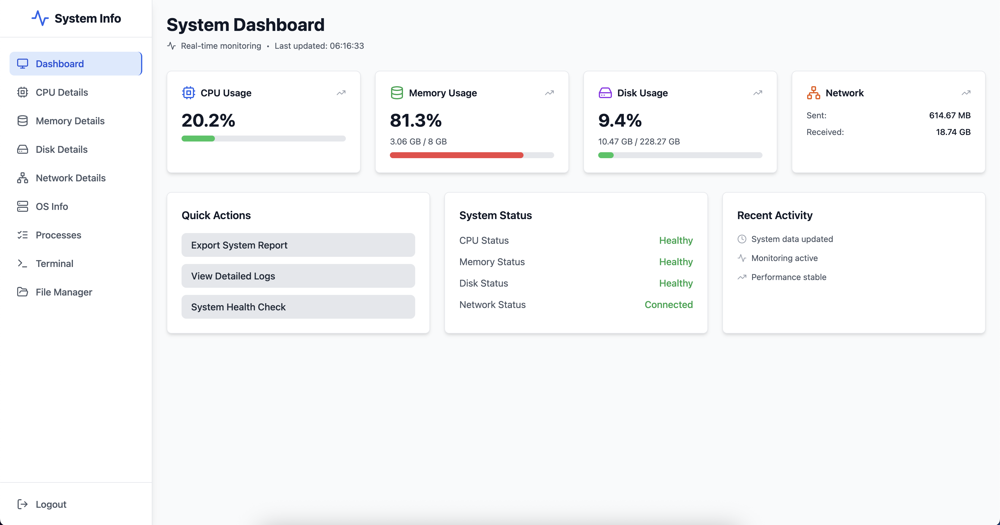
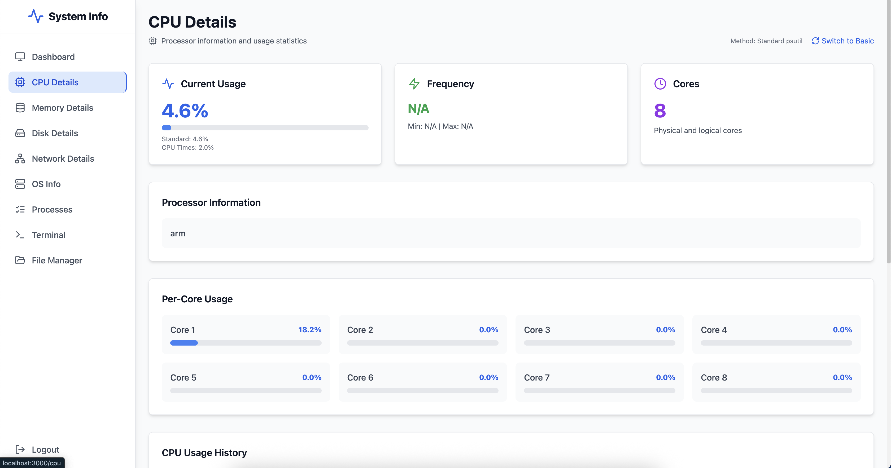
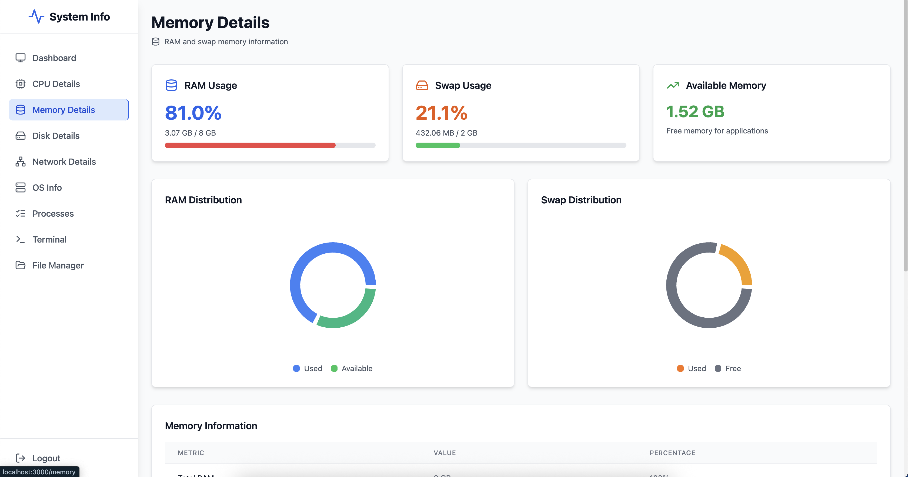
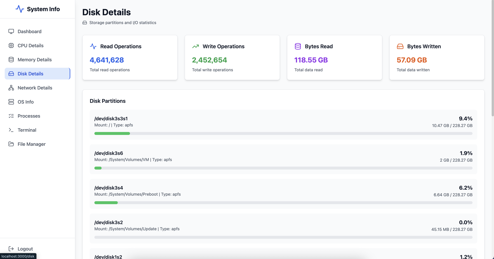
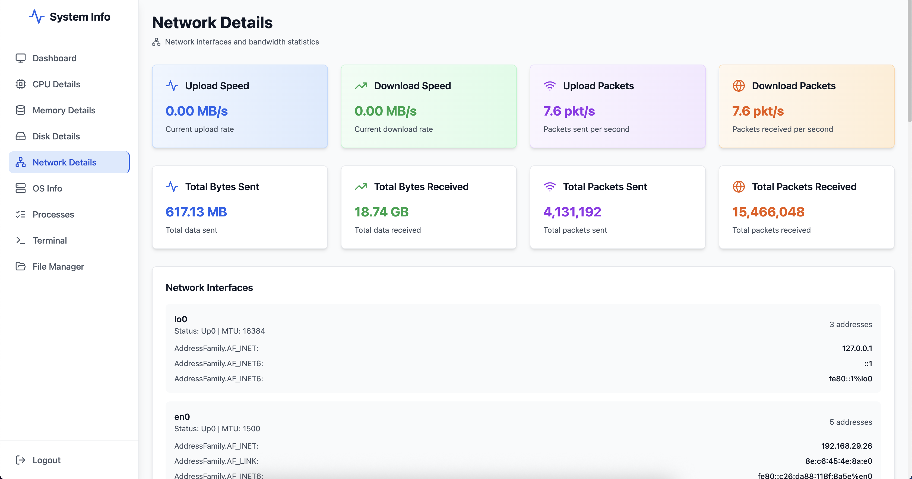
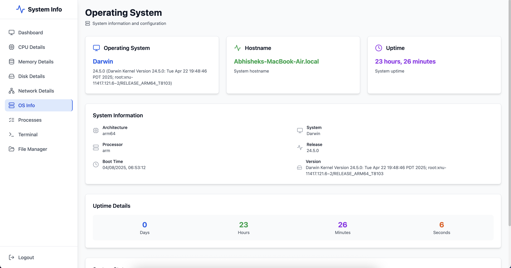
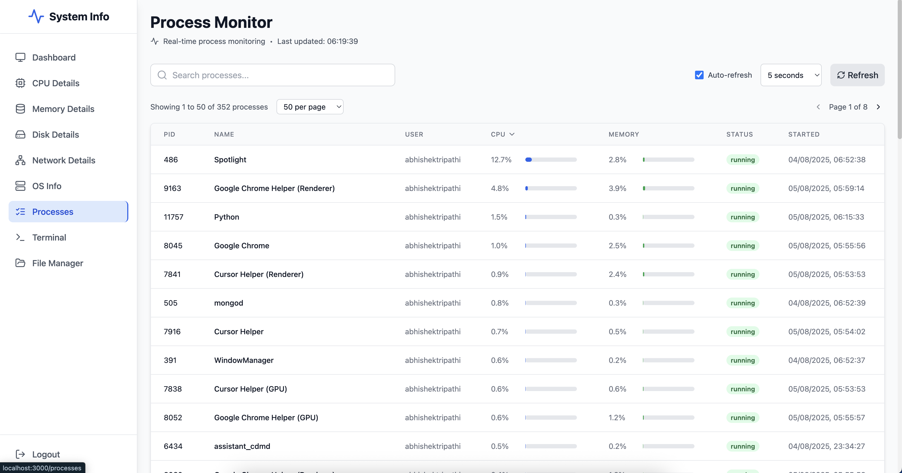
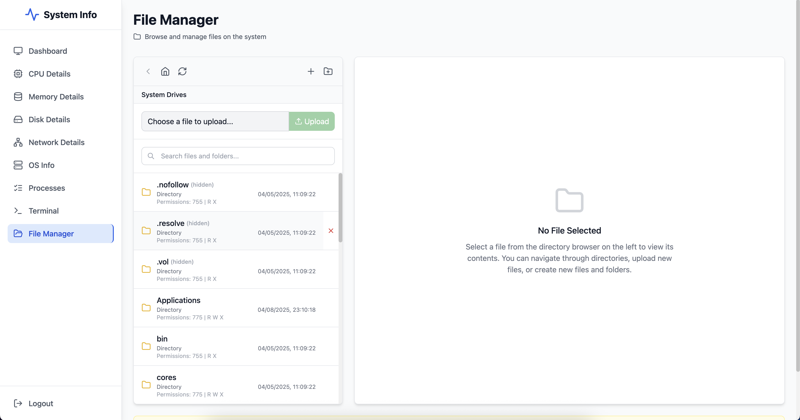
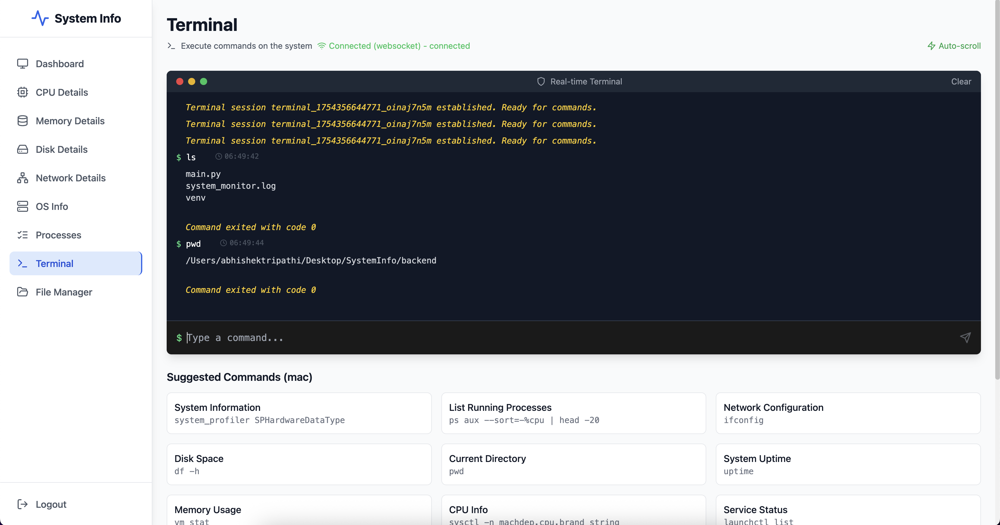

<div align="center">

# 🛡️ ServerGuard

**A Modern Self-Hosted Server Monitoring & Management Platform**

[](https://python.org)
[](https://reactjs.org)
[](https://fastapi.tiangolo.com)
[](https://tailwindcss.com)
[](LICENSE)
[](CONTRIBUTING.md)
[](https://github.com/abhins0554/ServerGuard)
[](https://github.com/abhins0554/ServerGuard)
[](https://github.com/abhins0554/ServerGuard)
[](https://github.com/abhins0554/ServerGuard)
[](https://github.com/abhins0554/ServerGuard/issues)
[](https://github.com/abhins0554/ServerGuard/blob/main/LICENSE)

*Real-time system monitoring, file management, and terminal access in one powerful web interface*

[🚀 Quick Start](#-quick-start) • [📊 Features](#-features) • [🛠️ Tech Stack](#️-tech-stack) • [📖 Documentation](#-documentation) • [🤝 Contributing](#-contributing)

</div>

---

## 📋 Table of Contents

- [🎯 Overview](#-overview)
- [✨ Key Features](#-key-features)
- [🖼️ Screenshots](#️-screenshots)
- [🚀 Quick Start](#-quick-start)
- [🛠️ Installation](#️-installation)
- [📊 Features](#-features)
- [🛠️ Tech Stack](#️-tech-stack)
- [🔧 Configuration](#-configuration)
- [📈 Performance](#-performance)
- [🔒 Security](#-security)
- [📝 API Documentation](#-api-documentation)
- [🚀 Deployment](#-deployment)
- [🔧 Troubleshooting](#-troubleshooting)
- [🤝 Contributing](#-contributing)
- [📄 License](#-license)

---

## 🎯 Overview

**ServerGuard** is a comprehensive, self-hosted server monitoring and management platform that provides real-time system monitoring, file management, and terminal access through a modern web interface. Built with **FastAPI** backend and **React** frontend, it offers enterprise-grade monitoring capabilities for developers, system administrators, and DevOps teams.

### 🌟 Why Choose ServerGuard?

- **🔒 Self-Hosted**: Complete control over your data and infrastructure
- **⚡ Real-Time**: Live system monitoring with WebSocket connections
- **🎨 Modern UI**: Beautiful, responsive interface built with React & Tailwind CSS
- **🛡️ Secure**: Built-in authentication and command execution protection
- **📱 Cross-Platform**: Works on Windows, macOS, and Linux
- **🚀 Easy Setup**: One-command installation and startup
- **📊 Comprehensive**: CPU, Memory, Disk, Network, and Process monitoring
- **💻 Terminal Access**: Web-based terminal with real-time command execution

---

## ✨ Key Features

<div align="center">

| **System Monitoring** | **File Management** | **Terminal Access** |
|:---:|:---:|:---:|
| Real-time CPU, Memory, Disk & Network monitoring | Full file system browser with upload/download | WebSocket-based real-time terminal |
| Process management with pagination | In-browser file editor | Command history & auto-completion |
| OS information & hardware details | Binary file support | Session persistence |

</div>

---

## 🖼️ Screenshots

### 📈 **Dashboard Overview**

*Comprehensive system overview with real-time metrics and performance indicators*

### 🖥️ **CPU Monitoring**

*Detailed CPU usage with per-core breakdown and performance analytics*

### 💾 **Memory Management**

*RAM and swap memory usage with detailed statistics and trends*

### 💿 **Disk Monitoring**

*Storage usage across all partitions with I/O statistics and space analysis*

### 🌐 **Network Monitoring**

*Network interface statistics and traffic monitoring with bandwidth analysis*

### 🖥️ **OS Information**

*System details, uptime, and comprehensive hardware information*

### 📋 **Process Management**

*Real-time process monitoring with resource usage and management capabilities*

### 📁 **File Manager**

*Full file system access with upload, download, and editing capabilities*

### 💻 **Terminal Access**

*WebSocket-based terminal with live command execution and output streaming*

---

## 🚀 Quick Start

### Prerequisites
- **Python 3.8+**
- **Node.js 16+**
- **npm** or **yarn**

### ⚡ One-Command Setup

```bash
# Clone and setup
git clone https://github.com/abhins0554/ServerGuard
cd ServerGuard

# Install dependencies and start
python start.py
```

### 🔧 Manual Setup

<details>
<summary><b>Step-by-step installation</b></summary>

```bash
# 1. Clone repository
git clone https://github.com/abhins0554/ServerGuard
cd ServerGuard

# 2. Install Python dependencies
pip install -r backend/requirements.txt

# 3. Install Node.js dependencies
cd frontend
npm install
cd ..

# 4. Start the application
python start.py
```

</details>

### 🌐 Access the Application

- **Dashboard**: http://localhost:3000
- **API Docs**: http://localhost:8000/docs
- **Default Login**: `admin` / `admin123`

---

## 🛠️ Installation

### 🐳 Docker Installation

```bash
# Using Docker Compose
docker-compose up -d
```

### 📦 Manual Installation

<details>
<summary><b>Detailed installation guide</b></summary>

#### Backend Setup
```bash
cd backend
pip install -r requirements.txt
python main.py
```

#### Frontend Setup
```bash
cd frontend
npm install
npm start
```

</details>

---

## 📊 Features

### 🔍 **System Monitoring**
- **Real-time CPU monitoring** with per-core breakdown
- **Memory usage tracking** including RAM and swap
- **Disk space monitoring** with I/O statistics
- **Network interface monitoring** with traffic analysis
- **Process management** with resource usage
- **OS information** and hardware details

### 📁 **File Management**
- **Full file system browser** with navigation
- **File upload/download** with progress tracking
- **In-browser file editor** for text files
- **Binary file support** with safe handling
- **File creation and deletion** capabilities
- **Search functionality** for files and folders

### 💻 **Terminal Access**
- **WebSocket-based terminal** with real-time output
- **Command history** navigation with arrow keys
- **Auto-completion** for common commands
- **Session persistence** across page refreshes
- **Security protection** against dangerous commands
- **Connection status** monitoring

### ⚡ **Performance Features**
- **Async operations** with thread pool execution
- **Intelligent caching** for faster response times
- **WebSocket streaming** for real-time updates
- **Pagination** for large datasets
- **Progress tracking** for file operations

---

## 🛠️ Tech Stack

### Backend Architecture
<div align="center">

| **Framework** | **Purpose** | **Version** |
|:---|:---|:---:|
| **FastAPI** | High-performance async web framework | Latest |
| **psutil** | System and process utilities | Latest |
| **aiofiles** | Async file operations | Latest |
| **WebSockets** | Real-time communication | Latest |
| **ThreadPoolExecutor** | CPU-intensive task management | Built-in |

</div>

### Frontend Architecture
<div align="center">

| **Technology** | **Purpose** | **Version** |
|:---|:---|:---:|
| **React** | Modern UI framework | 18+ |
| **Tailwind CSS** | Utility-first CSS framework | 3.0+ |
| **Lucide React** | Beautiful icons | Latest |
| **Axios** | HTTP client with caching | Latest |
| **WebSocket API** | Real-time communication | Built-in |

</div>

---

## 📈 Performance

### ⚡ Backend Optimizations
- **Async Operations**: All system calls run in thread pool
- **Intelligent Caching**: 5-second cache for system metrics
- **Pagination**: Process lists paginated for better performance
- **WebSocket Streaming**: Real-time terminal output
- **Optimized File Operations**: Async file I/O with caching

### 🚀 Frontend Optimizations
- **Request Caching**: Client-side caching with TTL
- **WebSocket Management**: Efficient connection handling
- **Pagination**: Large datasets handled efficiently
- **Progress Tracking**: Upload/download progress indicators
- **Debounced Updates**: Reduced API calls

### 📈 Caching Strategy
| **Data Type** | **Cache Duration** | **Purpose** |
|:---|:---:|:---|
| System Metrics | 2-5 seconds | Real-time data |
| File Content | 30 seconds | Text files |
| Directory Listings | 10 seconds | File browsing |
| OS Information | 1 minute | Static data |

---

## 🔒 Security

### 🛡️ Command Execution Protection
- **Blocked Commands**: `rm -rf`, `format`, `mkfs`, `dd`
- **Timeout Limits**: 30-second command execution timeout
- **Process Isolation**: Cleanup and isolation mechanisms

### 🔐 File System Security
- **Path Validation**: Sanitization and validation
- **File Size Limits**: 10MB display limit for safety
- **Binary Detection**: Safe handling of binary files
- **Permission Handling**: Comprehensive error management

### 🔑 Authentication
- **Bearer Token**: Secure token-based authentication
- **Session Management**: Persistent user sessions
- **Auto Logout**: Automatic logout on token expiry

---

## 📝 API Documentation

### 🔗 System Endpoints
| **Endpoint** | **Method** | **Description** |
|:---|:---:|:---|
| `/api/system/summary` | GET | System overview |
| `/api/system/cpu` | GET | CPU information |
| `/api/system/memory` | GET | Memory information |
| `/api/system/disk` | GET | Disk information |
| `/api/system/network` | GET | Network information |
| `/api/system/processes` | GET | Process list with pagination |

### 📁 File Endpoints
| **Endpoint** | **Method** | **Description** |
|:---|:---:|:---|
| `/api/files/list` | GET | Directory listing |
| `/api/files/content` | GET | File content |
| `/api/files/update` | POST | Update file |
| `/api/files/upload` | POST | Upload file |
| `/api/files/download` | GET | Download file |

### 🔌 WebSocket Endpoints
| **Endpoint** | **Description** |
|:---|:---|
| `/ws/system` | Real-time system monitoring |
| `/ws/terminal/{session_id}` | Real-time terminal |

---

## 🚀 Deployment

### 🐳 Docker Deployment

```bash
# Build and run with Docker Compose
docker-compose up -d
```

### 🏭 Production Deployment

<details>
<summary><b>Backend Deployment</b></summary>

```bash
# Using Gunicorn
pip install gunicorn
gunicorn -w 4 -k uvicorn.workers.UvicornWorker backend.main:app

# Using Docker
docker build -t serverguard-backend .
docker run -p 8000:8000 serverguard-backend
```

</details>

<details>
<summary><b>Frontend Deployment</b></summary>

```bash
# Build for production
cd frontend
npm run build

# Serve with nginx
sudo cp -r build/* /var/www/html/
```

</details>

---

## 🔧 Configuration

### 📝 Environment Variables

Create a `.env` file in the project root:

```env
# Authentication
SECRET_KEY=your-secret-key-change-this-in-production
ADMIN_USERNAME=admin
ADMIN_PASSWORD=admin123

# Server Configuration
HOST=0.0.0.0
PORT=8000

# Frontend Configuration
REACT_APP_API_URL=http://localhost:8000

# Development Settings
DEBUG=true
LOG_LEVEL=info
```

### 🔐 Security Considerations
- ✅ Change default admin credentials
- ✅ Use strong SECRET_KEY
- ✅ Configure CORS origins for production
- ✅ Implement proper JWT authentication for production

---

## 🔧 Troubleshooting

### ❗ Common Issues

<details>
<summary><b>Port Already in Use</b></summary>

```bash
# Check what's using the port
netstat -tulpn | grep :8000
# Kill the process or change port
```

</details>

<details>
<summary><b>Permission Denied</b></summary>

```bash
# Ensure proper file permissions
chmod +x start.py
```

</details>

<details>
<summary><b>WebSocket Connection Issues</b></summary>

- Check firewall settings
- Verify CORS configuration
- Ensure WebSocket proxy configuration

</details>

### ⚡ Performance Issues

<details>
<summary><b>Slow API Responses</b></summary>

- Check system resources
- Monitor cache hit rates
- Review thread pool configuration

</details>

<details>
<summary><b>High Memory Usage</b></summary>

- Adjust cache TTL settings
- Monitor process list size
- Review file upload limits

</details>

---

## 🤝 Contributing

We welcome contributions! Please see our [Contributing Guidelines](CONTRIBUTING.md) for details.

### 🚀 Quick Contribution Steps

1. **Fork** the repository
2. **Create** a feature branch (`git checkout -b feature/amazing-feature`)
3. **Commit** your changes (`git commit -m 'Add amazing feature'`)
4. **Push** to the branch (`git push origin feature/amazing-feature`)
5. **Open** a Pull Request

### 📋 Development Setup

```bash
# Clone and setup development environment
git clone https://github.com/abhins0554/ServerGuard
cd ServerGuard

# Install development dependencies
pip install -r backend/requirements.txt
cd frontend && npm install && cd ..

# Run in development mode
python start.py
```

### 🎯 Areas for Contribution

- **🔍 System Monitoring**: Additional metrics and monitoring features
- **🛡️ Security**: Enhanced security features and authentication
- **📱 UI/UX**: Mobile responsiveness and user experience improvements
- **🐳 Docker**: Containerization and deployment improvements
- **🧪 Testing**: Unit and integration tests
- **📚 Documentation**: API documentation and guides

---

## 📄 License

This project is licensed under the **MIT License** - see the [LICENSE](LICENSE) file for details.

---

## 🙏 Acknowledgments

- **[FastAPI](https://fastapi.tiangolo.com)** for the excellent async web framework
- **[psutil](https://github.com/giampaolo/psutil)** for comprehensive system monitoring
- **[React](https://reactjs.org)** and **[Tailwind CSS](https://tailwindcss.com)** for the beautiful UI
- All contributors and users of this project

---

<div align="center">

**⭐ Star this repository if you find it useful!**

**🔗 [Report Issues](https://github.com/abhins0554/ServerGuard/issues) • [Request Features](https://github.com/abhins0554/ServerGuard/issues/new) • [View on GitHub](https://github.com/abhins0554/ServerGuard) • [Star Repository](https://github.com/abhins0554/ServerGuard)**

---

**⚠️ Note**: This tool is designed for self-hosted environments. For production use, ensure proper security configurations and consider implementing additional authentication mechanisms.

</div> 